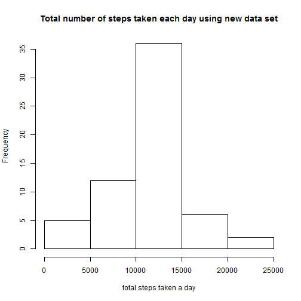

Reproducible Research - Peer Assignment 1
========================================================

This is an R Markdown document describing the data analyses of the activity data obtained from activity monitoring devices

### Loading and Preprocessing Data
Assuming current working directory contains the "activity.zip" file downloaded from the course webpage 


```r
# unzip data file to csv file if the csv file does not already exist
if (file.exists("activity.csv") == FALSE) {
    unzip("activity.zip")
}

# load the data
activity <- read.csv("activity.csv")
```


### What is mean total number of steps taken per day?
This code chunk will:
* aggregate total number of steps taken by date
* create a histogram of the total number of steps taken per date
* calculate the mean and median of the total number of steps taken per date


```r
# aggregate data by date
total.steps.by.date <- aggregate(activity$steps, list(activity$date), sum)

# add labels to aggregated data
colnames(total.steps.by.date) <- c("date", "total.steps")

# make a histogram of total steps taken each day
hist(total.steps.by.date$total.steps, main = "Total number of steps taken each day", 
    xlab = "total steps taken a day")
```

 

```r

# calculate mean and median of total number of steps taken each day
mean <- mean(total.steps.by.date$total.steps, na.rm = TRUE)
median <- median(total.steps.by.date$total.steps, na.rm = TRUE)

# print mean and median
print(mean)
```

```
## [1] 10766
```

```r
print(median)
```

```
## [1] 10765
```


Based on the analysis, the mean and median of the total daily number of steps is 10766 and 10755 respectively.

### What is the average daily activity pattern?
This code chunk below will
* aggregate the number of steps averaged acrossed all days (y) by interval (x)
* plot y vs x 

For this particular analysis, instead of using the aggregate(), I will use the ddply() from the "plyr"" package. 


```r
# check if the 'plyr' package exists and install it if it doesn't
if (!("plyr" %in% installed.packages())) {
    install.packages("plyr")
}

# load 'plyr' package
library(plyr)

# aggregate the activity data by interval and number of steps averaged
# across all days
avg.steps.by.interval <- ddply(activity, .(interval), summarize, avg.steps = mean(steps, 
    na.rm = TRUE))

# plot the average number of steps averaged across all days vs interval
plot(avg.steps.by.interval$interval, avg.steps.by.interval$avg.steps, type = "l", 
    main = "Number of steps averaged across all days taken every 5 minute", 
    xlab = "5-minute interval", ylab = "Average number of steps")
```

 

```r

# find the max average number of steps and its corresponding interval
max.interval <- avg.steps.by.interval[avg.steps.by.interval$avg.steps == max(avg.steps.by.interval$avg.steps), 
    ]

# print the interval that has the max average number of steps
print(max.interval[1, 1])
```

```
## [1] 835
```


Based on the analysis, interval 835 contains the maximum number of steps averaged across all days

### Imputing missing values
Original data contains some missing values. These can bias the calculation and summeries of data. This analysis does the following:
* Plot steps vs interval for all days (to see how steps change during a day )
* Report the number of missing values
* Fill in values for the missing cases using the following strategy:
        * For each interval for a particular day that doesn't have a value, fill in the corresponding                                 number of steps averaged across all days.

#### Visualize activity data        

```r
# check if 'ggplot2' package exists and install if if it doesn't
if (!("ggplot2" %in% installed.packages())) {
    install.packages("ggplot2")
}

# load the 'ggplot2' package
library(ggplot2)

# summerize activity data using ggplot
p <- ggplot(data = activity, aes(x = interval, y = steps)) + ggtitle("Number of steps taken in 5-min interval over 2 months") + 
    facet_wrap(~date) + geom_line() + theme(axis.text.x = element_text(size = 8)) + 
    theme(plot.title = element_text(size = 20))
print(p)
```

 


#### Report number of missing values

```r
# filter rows in activity data that has NA values
missing.data <- activity[is.na(activity$steps), ]

# count number of rows with missing values
num.NA <- dim(missing.data)[1]
print(num.NA)
```

```
## [1] 2304
```


Based on the analysis, there are 2304 intervals that do not have data for number of steps recorded

#### Fill in values for missing cases


```r
# find the row index of missing values in activity data
index.NA <- which(is.na(activity$steps))

# define a function to look up the average number of steps for the interval
# that correspond to the missing values in one data frame from another data
# frame
FillNA <- function(x, df1, df2) {
    # Look up average number of steps in df2 by matching interval from df1 Args:
    # x: row index in df1 df1: data frame ~ activity data df2: data frame ~
    # avg.steps.by.interval Returns: average number of steps the interval in df1
    # that correspond to index x
    interval <- df1$interval[x]
    # row index in df2 for which there is a matched interval
    index <- which(df2$interval == interval)
    # return the avergage number of steps corresponding to the index
    df2$avg.steps[index]
}

# create a copy of activity data
filled.activity <- activity

# replace missing values in filled.activity with average number of steps for
# the corresponding interval
filled.activity$steps[index.NA] <- sapply(index.NA, FillNA, df1 = activity, 
    df2 = avg.steps.by.interval)
```


#### Analyze new data set (with no missing values) and compare with old data set 
This code chunk will:
* aggregate total number of steps taken by date
* create a histogram of the total number of steps taken per date
* calculate the mean and median of the total number of steps taken per date


```r
# aggregate data by date
new.total.steps.by.date <- ddply(filled.activity, .(date), summarize, total_steps = sum(steps))

# add labels to aggregated data
colnames(new.total.steps.by.date) <- c("date", "total.steps")

# make a histogram of total steps taken each day
hist(new.total.steps.by.date$total.steps, main = "Total number of steps taken each day using new data set", 
    xlab = "total steps taken a day")
```

 

```r

# calculate mean and median of total number of steps taken each day
new_mean <- mean(new.total.steps.by.date$total.steps, na.rm = TRUE)
new_median <- median(new.total.steps.by.date$total.steps, na.rm = TRUE)

# print mean and median
print(new_mean)
```

```
## [1] 10766
```

```r
print(new_median)
```

```
## [1] 10766
```


Based on the above analysis, the mean of the total daily number of steps using the filled-in data is the same as that using the missing-value data set. THe median of the total daily number of steps using filled-in data is different from that using the missing-value data set by 1 unit. While imputing missing values does not affect the mean and median of total daily number of steps, it increases the occurence (frequency) of the total daily number of steps (as shown in the histogram)

### Are there differences in activity patterns between weekdays and weekends?
This code chunk will:
* Convert the date in the fill-in data set to either weekday or weekend
* Aggregate the data by interval, date level, and average number of steps across weekday or weekkend
* Plot average number of steps vs interval 


```r
# convert date to day of the week
day.of.the.week <- weekdays(as.Date(filled.activity$date))

# check if the date is weekday or weekend
IsWeekend <- function(x) {
    if (x != "Saturday" & x != "Sunday") 
        "weekday" else "weekend"
}

# convert day.of.the.week to either weekend of weekday
day.level <- sapply(day.of.the.week, IsWeekend)

# add day.level to filled.activity
new.data <- cbind(filled.activity, day.level)

# aggregate new.data by interval and day.level
agg.data <- ddply(new.data, .(interval, day.level), summarize, avg = mean(steps))

# plot average steps for weekday and weekend
ggplot(agg.data, aes(x = interval, y = avg)) + geom_line() + facet_wrap(~day.level) + 
    labs(y = "Average number of steps") + ggtitle("Average number of steps in weekday and weekend") + 
    theme(plot.title = element_text(size = 25)) + theme(strip.text = element_text(size = 15))
```

 


Based on the analysis, it appears that the subject display different pattern in his/her activity between weekdays and weekends. 
